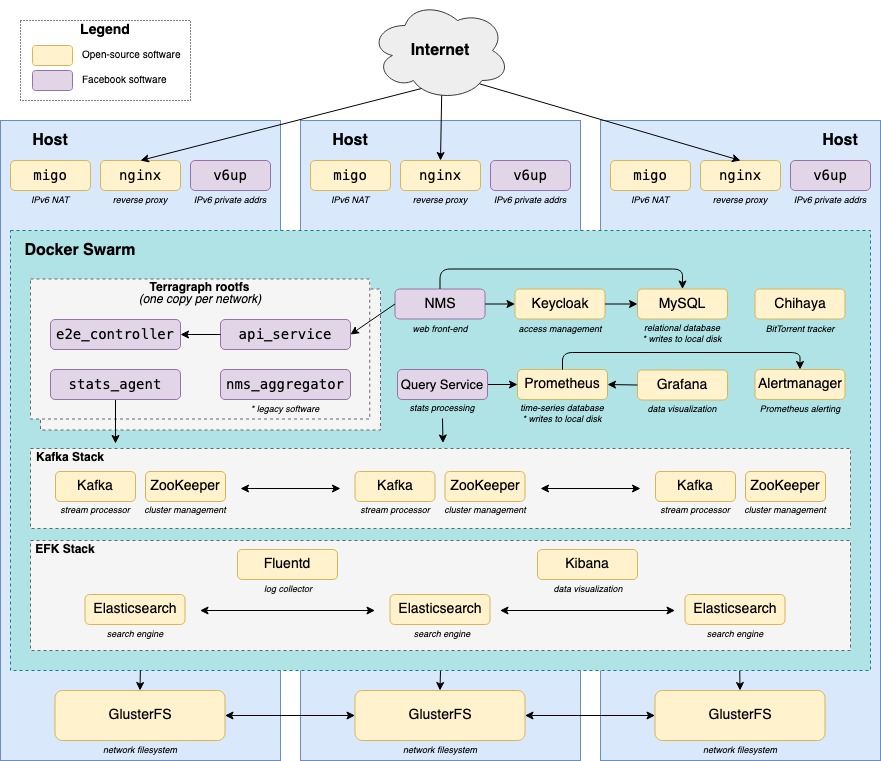
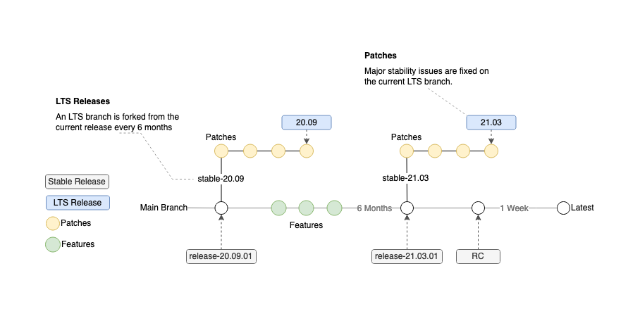

# Terragraph Software

[Terragraph](https://terragraph.com/) is a 60GHz, multi-node wireless Software Defined Network (SDN) that enables high-speed internet connectivity in multiple environments. It incorporates commercial, off-the-shelf components and industrial design for quick and affordable deployments across many markets. The network operates best in Line-Of-Sight (LOS) conditions to maximize connectivity. In its essence, Terragraph is “wireless fiber” with gigabit speeds, rapid deployment capability, and flexible use case support.

This repo contains code for the Terragraph Network Management System (TGNMS).

# Installation of TGNMS
The Terragraph cloud suite is deployed as a set of Docker services in a Docker Swarm. Terragraph includes an executable installer that automatically configures the Docker Swarm and installs all of the cloud services.

## Requirements
Docker Swarm requires at least 3 hosts (Docker hosts) for redundancy. If redundancy is not required, fewer hosts can still run the cloud suite. Each Docker host must have the following specs to run a network with roughly 512 sectors:

* *OS:* CentOS 7 or Ubuntu 17+
* *CPU:* 4 vCPU
* *Memory:* 16GB
* *Disk Space:* 200GB
* *Networking:* Globally addressable IPv6 and private (or global) IPv4
* *Hostnames:* Hosts _must_ have unique hostnames (hostnamectl set-hostname <unique hostname>)

PARTITIONING Scheme

* /root - 20GB
* /opt - 130GB
* /var/lib/docker - 50GB

Each Docker host must have a public IPv6 address and a private (or public) IPv4 address. An installation host that has SSH access to all the Docker hosts is necessary to run the installer on. The installation host must have python3 (and ssh-pass if password based SSH is used) installed. The installation host can be one of the Docker hosts.

TGNMS is deployed via Ansible scripts run by an installer tool.

## Installation from Source

```bash
git clone https://github.com/terragraph/tgnms
cd tgnms/nms_stack
python -m pip install .

# Verify the installer tool was installed correctly
nms install --help

# Create the configuration file from this template.
nms show-defaults > config.yml

# Modify the config file.

# Run the installer tool
nms install -f config.yml
```
## Installation from PEX
```bash
# Download release via this command or from the Releases section on Github.
wget https://github.com/terragraph/tgnms/releases/latest/download/nms

chmod +x nms
nms --version

# Install Python 3.8 on the installation host.
sudo apt-get install python3-distutils-extra
sudo apt-get install python3.8

# Create the configuration file from this template.
nms show-defaults > config.yml

# Modify the config file.

# Run the installer tool
nms install -f config.yml
```
# Developer Guide

## [Developer Guide for `tgnms`](https://github.com/terragraph/tgnms/blob/main/tgnms/fbcnms-projects/tgnms/README.md)
^^^^^^^^^^^^^^^^^^^^^^^^^^^^^

## Overal Architecture


## Release Process
1. Code changes are merged into main or an LTS branch.
    - All tests/linters must pass and the Pull Request must be approved by a key maintainer/code owner.
2. Our Github Actions jobs start, building the docker images and creating the installer pex.
3. These assets are then made available via Github Releases, tagged with its version name.

In order to understand the release process, it’s important to understand what a release is and how it is generated. The NMS stack mainly consists of docker images published to the registry, and the CLI installer. At its core, a single release is a set of docker images and the CLI installer, which were built from a branch of the codebase at the same point in time.



## Upgrading
### Upgrading E2E Controllers
The installer also performs controller upgrades. Running the upgrade command upgrades e2e_controller, api_service, stats_agent, and nms_aggregator to the image specified by <docker_image>. It also copies the controller's data folder and mounts the new copy in the controller container. This provides automatic backups of the topology and config.
```bash
nms upgrade -f config.yml -c <controller_name> -i <docker_image> -h my-e2e-controller01
```

### Upgrading other services
```bash
docker service update --with-registry-auth --image <image> <service_name>
```

## Clearing topology from controller
You may want to do this because your testing or playing around with the topology and you want to delete the nodes/links/sites afterwards:
1. Find the IP of the controller your network is on and login to it.
2. Determine how the controller was hosted.
    1. **K8s**: has ~/.kube folder (TODO: log steps after you do them)

        ```yaml
        cd /opt/terragraph/gfs/e2e/<e2e_controller_name>/data
        mv topology.conf{,$(date "+%y%m%d")}
        # then delete the controller pod and itll bring itself back up.
        ```

    2. **Swarm**: has docker stuff

        ```yaml
        cd /opt/terragraph/gfs/e2e/<e2e_controller_name>/data
        mv topology.conf{,$(date "+%y%m%d")}
        docker service ls # find the service ending in e2e_controller
        docker service update --force <service_name>
        ```

    3. **Sytemd**: has systemctl list-units | grep e2e ⇒ someone compiled e2e and ran it with systemd

        ```yaml
        cd /root/data
        mv topology.conf{,$(date "+%y%m%d")}
        systemctl restart e2e_controller
        ```

## License

TGNMS has an MIT-style license as can be seen in the [LICENSE](LICENSE) file.
