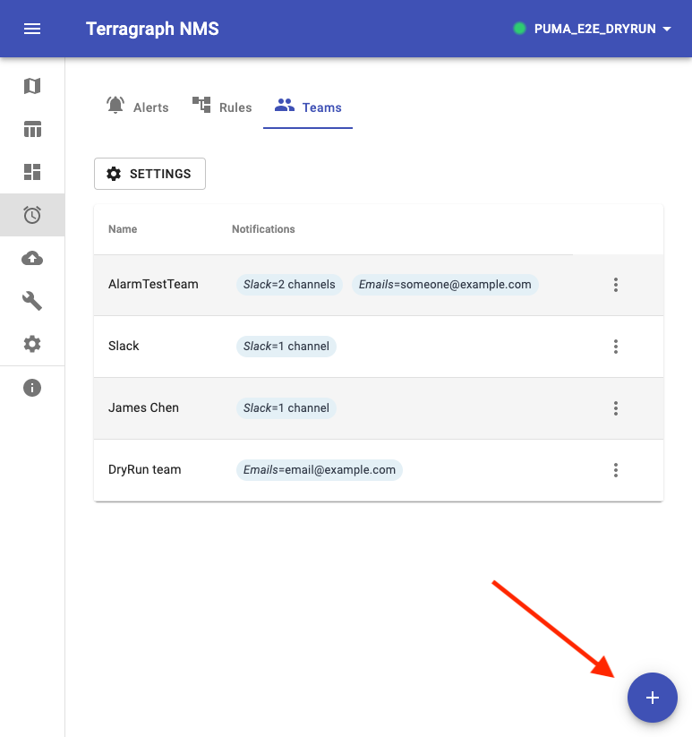

.. _alerts:

Alerts
======

The `alerts page </alarms/>`_ allows for configuring conditional alerts based on statistics in Prometheus. Alerts are fired when the condition in a rule is met. Alerts are sent to their configured team.

.. figure:: _static/alerts.png

The sections work as follows:

* **Alerts** - Show alerts that have already been fired
* **Rules** - Show and edit the conditions that are monitored
* **Teams** - Configure the teams that will be alerted when a rule is met

Create a Team
-------------

    Click the + button to add a new team

Alerts must be sent to a team. Teams contain one or more destinations for an alert. Alerts can be sent via:

* Slack (via a `webhook <https://api.slack.com/messaging/webhooks>`_)
* Email
* PagerDuty
* Pushover
* Webhook to a URL

Create a Rule
-------------
Rules query Prometheus to determine whether or not they should fire and create an alert. To create a rule, click the + button. The condition can be defined via the UI or by entering a `PromQL Query <https://prometheus.io/docs/prometheus/latest/querying/basics/>`_ directly.